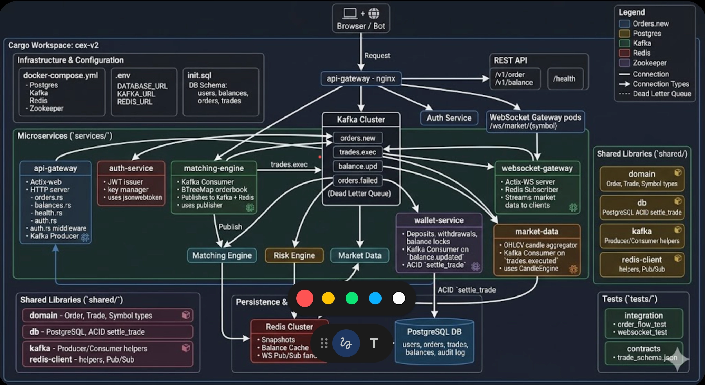
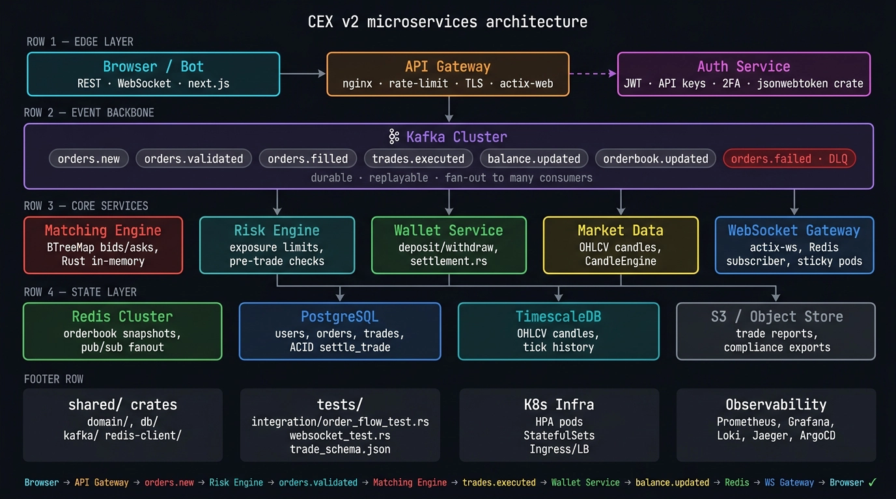

## The Design


## **Flow structure**

1. Client entry: `Browser / Bot -> API Gateway`, with `API Gateway <-> Auth Service` for JWT validation/issuance.
2. Order path: `API Gateway -> orders.new -> Risk Engine -> orders.validated or orders.failed`.
3. Match path: `orders.validated -> Matching Engine -> trades.executed + orderbook.updated`.
4. Settlement path: `trades.executed -> Wallet Service -> balance.updated -> Postgres/Redis`.
5. Market stream: `trades.executed -> Market Data -> candles.updated`.
6. Realtime delivery: `Redis Pub/Sub + WebSocket Gateway -> Browsers`.

A clean visual grouping would be:

- **Edge**: Browser/Bot, API Gateway, Auth Service.
- **Core services**: Risk Engine, Matching Engine, Wallet Service, Market Data, WebSocket Gateway.
- **Event backbone**: Kafka topics in the middle.
- **State**: Redis, Postgres.
- **Code support**: `shared/domain`, `shared/db`, `shared/kafka`, `shared/redis-client`, and `tests/` shown below as internal platform foundations, not as runtime nodes.
## The 5 Physical Machines (Docker Services)
```
[Browser / Bot]
      │
      ▼
[API Gateway - nginx]  ──────────────────────────────────┐
      │                                                   │
      ▼                                                   ▼
[Auth Service]          [REST API pods]      [WebSocket Gateway pods]
   JWT/2FA                /v1/order               /ws/market/{symbol}
                              │                          │
                              ▼                          │
                     [Kafka Cluster] ◄───────────────────┘
                     ┌─────────────┐
                     │ orders.new  │
                     │trades.exec  │
                     │balance.upd  │
                     │orders.failed│ ← Dead Letter Queue
                     └─────────────┘
                              │
             ┌────────────────┼────────────────┐
             ▼                ▼                ▼
     [Matching Engine]  [Risk Engine]    [Wallet Service]
     BTreeMap / Rust    Exposure Check   Deposit/Withdraw
             │                                 │
             ▼                                 ▼
      [Redis Cluster]                  [PostgreSQL DB]
      OrderBook Snapshots              users, orders,
      Balance Cache                    trades, balances
      WS Pub/Sub fanout
```

---

## The Cargo Workspace Folder Structure
```
cex-v2/
│
├── Cargo.toml                     # Workspace root (lists all crates)
├── docker-compose.yml             # Postgres + Kafka + Redis + Zookeeper
├── .env                           # DATABASE_URL, KAFKA_URL, REDIS_URL
├── init.sql                       # DB Schema (users, balances, orders, trades)
│
├── services/                      # ← Independent binaries (microservices)
│   │
│   ├── api-gateway/               # The public-facing HTTP server
│   │   ├── Cargo.toml
│   │   └── src/
│   │       ├── main.rs            # Actix-web + Kafka Producer
│   │       ├── routes/
│   │       │   ├── orders.rs      # POST /v1/order
│   │       │   ├── balances.rs    # GET /v1/balance
│   │       │   └── health.rs      # GET /health
│   │       └── middleware/
│   │           └── auth.rs        # JWT validation middleware
│   │
│   ├── auth-service/              # JWT issuer and key manager
│   │   ├── Cargo.toml
│   │   └── src/
│   │       ├── main.rs
│   │       └── jwt.rs             # jsonwebtoken crate
│   │
│   ├── matching-engine/           # The core BTreeMap matching loop
│   │   ├── Cargo.toml
│   │   └── src/
│   │       ├── main.rs            # Kafka Consumer loop
│   │       ├── orderbook.rs       # BTreeMap bids/asks (your existing code!)
│   │       └── publisher.rs       # Publishes trades to Kafka + Redis
│   │
│   ├── risk-engine/               # Pre-trade risk checks
│   │   ├── Cargo.toml
│   │   └── src/
│   │       ├── main.rs            # Kafka Consumer on orders.new
│   │       └── checks.rs          # Exposure limits, position sizing
│   │
│   ├── wallet-service/            # Deposits, withdrawals, balance locks
│   │   ├── Cargo.toml
│   │   └── src/
│   │       ├── main.rs            # Kafka Consumer on balance.updated
│   │       └── settlement.rs      # Your existing settle_trade() logic!
│   │
│   ├── websocket-gateway/         # WebSocket server for browsers
│   │   ├── Cargo.toml
│   │   └── src/
│   │       ├── main.rs            # Actix-WS + Redis Subscriber
│   │       └── feed.rs            # Streams trades/candles to clients
│   │
│   └── market-data/               # OHLCV candle aggregator
│       ├── Cargo.toml
│       └── src/
│           ├── main.rs            # Kafka Consumer on trades.executed
│           └── candle.rs          # Your existing CandleEngine logic!
│
├── shared/                        # ← Shared libraries (not binaries)
│   │
│   ├── domain/                    # Core types - Order, Trade, Symbol
│   │   ├── Cargo.toml
│   │   └── src/lib.rs             # Your existing domain types!
│   │
│   ├── db/                        # PostgreSQL access layer
│   │   ├── Cargo.toml
│   │   └── src/lib.rs             # Your existing ACID settle_trade!
│   │
│   ├── kafka/                     # Kafka producer/consumer helpers
│   │   ├── Cargo.toml
│   │   └── src/lib.rs             # rdkafka wrappers
│   │
│   └── redis-client/              # Redis access helpers
│       ├── Cargo.toml
│       └── src/lib.rs             # redis-rs wrappers, Pub/Sub helpers
│
└── tests/                         # Integration & contract tests
    ├── integration/
    │   ├── order_flow_test.rs     # Full order → match → settle flow
    │   └── websocket_test.rs      # WS receives trade after match
    └── contracts/
        └── trade_schema.json      # Schema Registry contract for Trade struct
```

---

## What you are REUSING from your old project (do not rewrite!)
| Old Location | New Location | Changes |
|---|---|---|
| `crates/engine/src/orderbook.rs` | `services/matching-engine/src/orderbook.rs` | Swap `mpsc::Sender<Trade>` for Kafka Producer |
| `crates/shared/domain/src/lib.rs` | `shared/domain/src/lib.rs` | Identical, zero changes |
| `crates/shared/db/src/lib.rs` | `shared/db/src/lib.rs` | Identical, zero changes |
| `crates/market_data/src/lib.rs` | `services/market-data/src/candle.rs` | Swap `broadcast::Receiver` for Kafka Consumer |
| WebSocket handler | `services/websocket-gateway/src/feed.rs` | Swap `broadcast::Receiver` for Redis Subscriber |

---

## The Phased Build Roadmap (Learn while Making)

### Phase 8.1 — Infrastructure Setup (Day 1)
- [ ] Create `cex-v2` workspace with `cargo new`
- [ ] Copy `shared/domain` and `shared/db` from old project **exactly**
- [ ] Build `docker-compose.yml` (Postgres + Kafka + Zookeeper + Redis)
- [ ] Boot and verify all 4 containers with `docker ps`
- [ ] **Rust Concept Learned:** Cargo Workspace with multiple binaries

### Phase 8.2 — Kafka Foundation (Day 1-2)
- [ ] Add `shared/kafka` crate with `rdkafka` 
- [ ] Write a "Hello Kafka" Producer in `api-gateway` (send a test JSON string)
- [ ] Write a "Hello Kafka" Consumer in `matching-engine` (receive and print)
- [ ] **Rust Concept Learned:** `rdkafka::producer::FutureProducer`, async consumer loops

### Phase 8.3 — API Gateway → Kafka (Day 2)
- [ ] Port order routes from old `crates/api` into `services/api-gateway`
- [ ] Replace `mpsc::send(order)` with Kafka `produce("orders.new", order_json)`
- [ ] Replace `db::lock_funds()` call from route handler into wallet-service consumer
- [ ] **Rust Concept Learned:** Serializing Rust structs to JSON bytes for Kafka

### Phase 8.4 — Matching Engine from Kafka (Day 3)
- [ ] Port `orderbook.rs` into `services/matching-engine`
- [ ] Add Kafka Consumer loop that feeds orders into the BTreeMap
- [ ] On match, produce `Trade` to `trades.executed` Kafka topic
- [ ] **Rust Concept Learned:** Consumer Groups, Offset Management

### Phase 8.5 — Redis Integration (Day 3-4)
- [ ] Add `shared/redis-client` crate with `redis-rs`
- [ ] Matching Engine publishes Trade to Redis Pub/Sub channel `trades.BTC_USD`
- [ ] WebSocket Gateway subscribes to Redis and streams to browser clients
- [ ] **Rust Concept Learned:** `redis::AsyncCommands`, Pub/Sub patterns in async Rust

### Phase 8.6 — Risk Engine (Day 4-5)
- [ ] Build `services/risk-engine` as a Kafka Consumer on `orders.new`
- [ ] If order passes checks → forward to `orders.validated`
- [ ] If order fails → send to `orders.failed` (Dead Letter Queue)
- [ ] **Rust Concept Learned:** Service-to-service routing via Kafka topics


